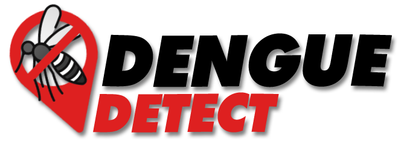

# Dengue Detect

<p align="center">
  
</p>

Bem-vindo ao meu projeto! Este README irá guiá-lo na instalação e uso.

**Descrição breve**  
Este trabalho tem como objetivo o desenvolvimento de um aplicativo voltado para a identificação  de focos de dengue na cidade de São Paulo. A proposta visa contribuir para o enfrentamento dessa grave questão de saúde pública, fornecendo uma solução tecnológica eficaz e de fácil utilização para auxiliar no controle e prevenção da propagação da dengue na região.

## Índice

- [Instalação](#instalação)
- [Uso](#uso)
- [Funcionalidades](#funcionalidades)
- [Tecnologias](#tecnologias)
- [Licença](#licença)

## Instalação

```bash

# Navegue até o diretório do projeto
cd DengueDetect

# Instale as dependências
yarn install

```
## Uso

```bash

# Para abrir o servidor
yarn start

# Caso esteja no modo de desenvolvimento, mude para Expo Go pressionando:
s

# Caso esteja no Expo Go e queria abrir no Android, pressione:
a
```

## Funcionalidades

- Informações sobre a dengue
- Mapa com casos de dengue nas regiões de São Paulo (Integração com a API [Info Dengue](https://info.dengue.mat.br/services/api))
- Um questionário para identificar quantos os sintomas apresentados equivalem aos sintomas da dengue
- Página com informações para denúncia de possíveis focos de dengue

## Tecnologias 


## Licença

Este projeto está licenciado sob a Licença MIT - consulte o arquivo [LICENSE](LICENSE) para detalhes.
